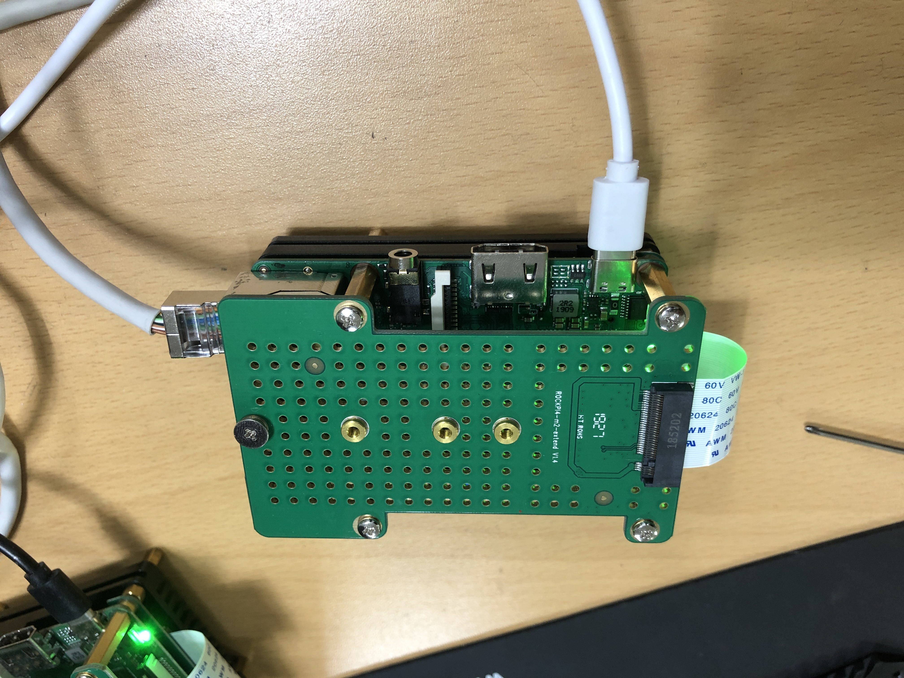
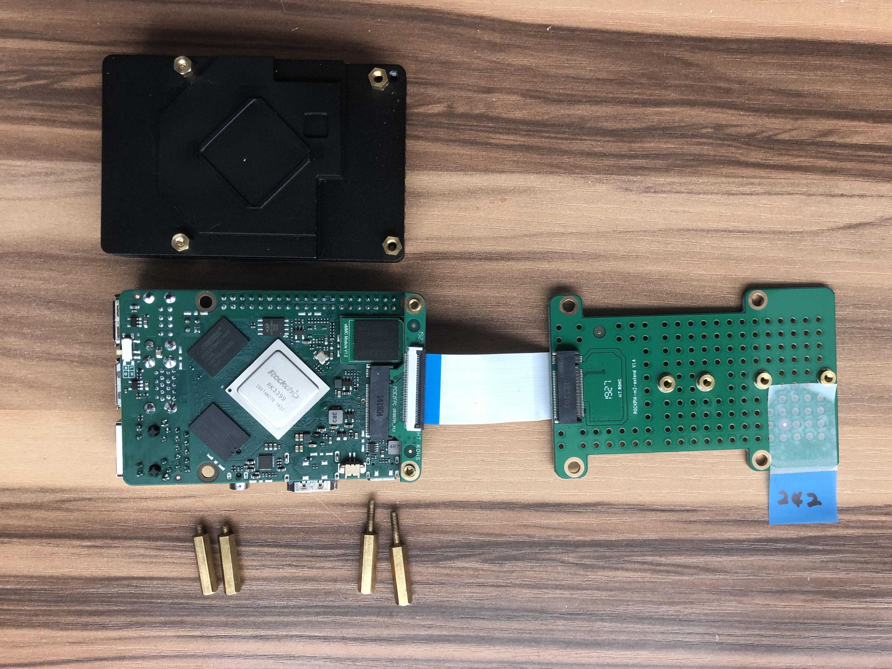
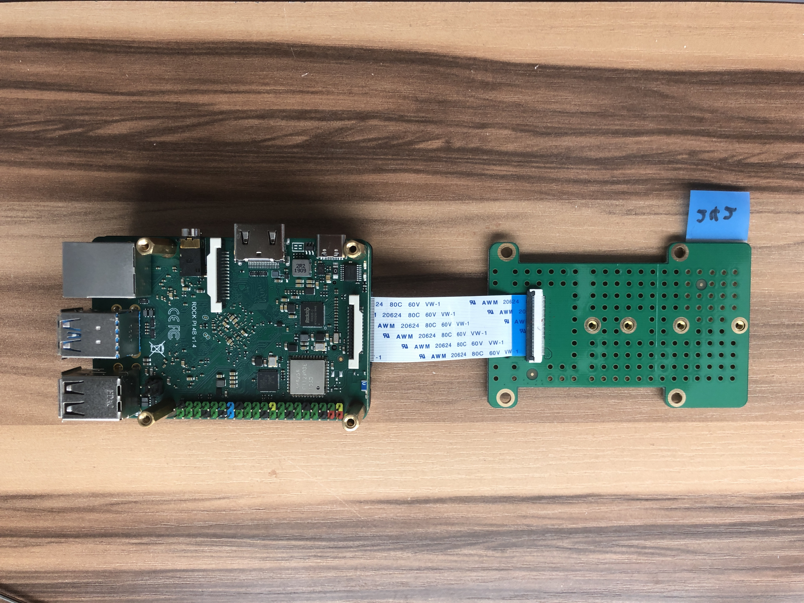
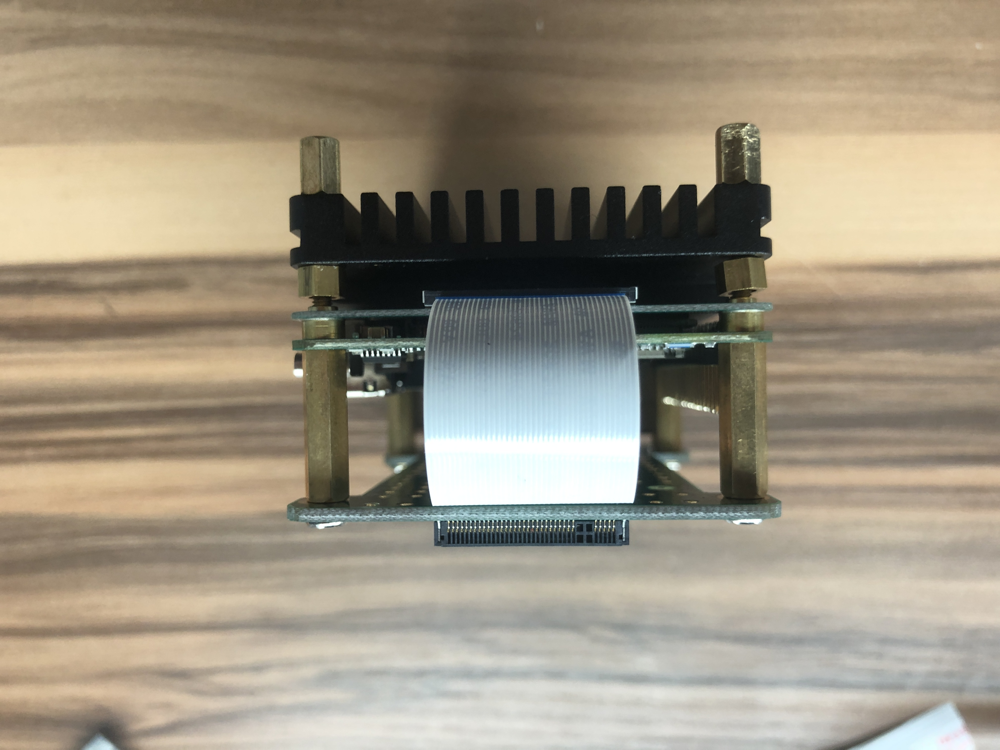
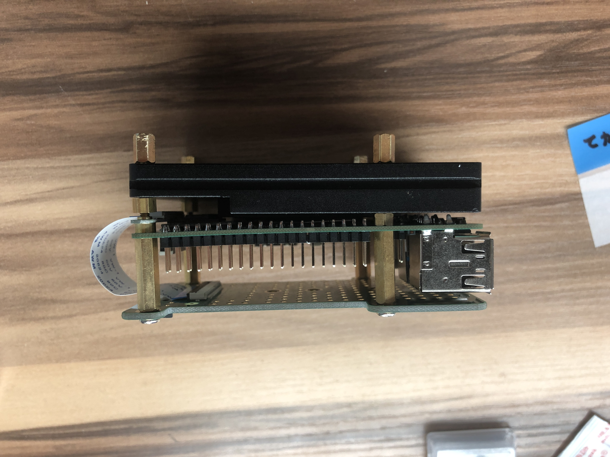
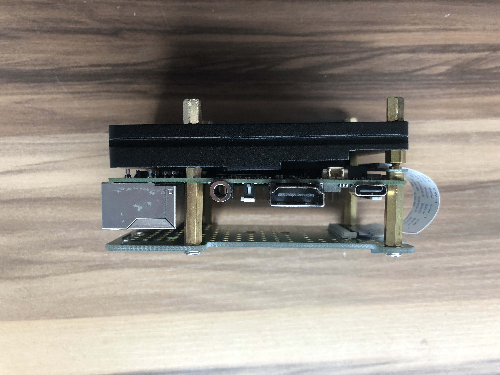

# 👨🏻‍🏫 GATEWAY SET UP MANUAL 👨🏻‍💻

## Contents

### [1. Gateway(Rock Pi 4) Initial Set Up](#I.-Gateway(Rock-Pi-4)-Initial-Set-Up)

### [2. Software Set Up](#II.-Software-Set-Up)

### [3. Auto Run Set Up](#III.-Auto-Run-Set-Up)

### [4. Validate Data Transmission](#IV.-Validate-Data-Transmission)


## I. Gateway(Rock Pi 4) Initial Set Up

### 1. 다운로드 ubuntu ISO, Etcher(iso 굽는 프로그램)
- https://wiki.radxa.com/Rockpi4/downloads
- Ubuntu Server 18.04: rockpi4b-ubuntu-bionic-minimal-20190104_2101-gpt.img.gz
- Etcher: balenaEtcher-Setup-1.4.9-x86.exe (windows)

### 2. 압축 풀기 / eMMC에 이미지 굽기
- rockpi4b-ubuntu-bionic-minimal-20190104_2101-gpt.img
- Etcher 실행
- iso 파일, eMMC 인식, Flash

### 3. eMMC 와 ROCK Pi 4 조립









### 4. 부팅, ssh세팅(option), 고정ip 세팅
- id: rock / password: rock
- SET SSH
```bash
# 목록확인
$ dpkg -l | grep openssh

# openssh 설치
$ apt-get update
$ apt-get install openssh-server openssh-client

# 목록 재확인
$ dpkg -l | grep openssh

# start service
$ service ssh start

# service 목록 확인
$ service --status-all | grep +

# 포트 점유 확인
$ netstat -antp

```

- static ip
```bash
$ apt-get update
$ apt-get install netplan.io
# /etc/netplan 폴더생성 확인
$ cd /etc/netplan
$ touch 01-network-manager-all.yaml
$ vim 01-network-manager-all.yaml
# yaml 입력
network:
    version: 2
    renderer: NetworkManager
    ethernets:
        eth0:
            addresses: [192.168.100.xx/24]
            gateway4: 192.168.100.1
            nameservers:
                addresses : [168.126.63.1,8.8.8.8]

            dhcp4: no

$ netplan apply
```

## II. Software Set Up

### <프로그램 리스트>
1. DataBase(mariadb 10.1.43)
2. Git
3. Collector(rpi_golang_scada)
4. Rock Pi 4 monitoring
5. EOCR manager

### 1. MariaDB 설치

#### MariaDB 설치 

- 참조 posting
- https://r00t4bl3.com/post/how-to-install-mysql-mariadb-server-on-raspberry-pi
```bash
$ sudo apt-get update
$ sudo apt-get upgrade
$ sudo apt-get install mariadb-server

Reading package lists... Done
Building dependency tree       
Reading state information... Done
The following additional packages will be installed:
  galera-3 gawk libaio1 libcgi-fast-perl libcgi-pm-perl libdbd-mysql-perl libdbi-perl libencode-locale-perl libfcgi-perl
  libhtml-parser-perl libhtml-tagset-perl libhtml-template-perl libhttp-date-perl libhttp-message-perl libio-html-perl libjemalloc1
  liblwp-mediatypes-perl libreadline5 libsigsegv2 libterm-readkey-perl libtimedate-perl liburi-perl lsof mariadb-client-10.1
  mariadb-client-core-10.1 mariadb-common mariadb-server-10.1 mariadb-server-core-10.1 socat
Suggested packages:
  gawk-doc libclone-perl libmldbm-perl libnet-daemon-perl libsql-statement-perl libdata-dump-perl libipc-sharedcache-perl libwww-perl
  mariadb-test tinyca
The following NEW packages will be installed:
  galera-3 gawk libaio1 libcgi-fast-perl libcgi-pm-perl libdbd-mysql-perl libdbi-perl libencode-locale-perl libfcgi-perl
  libhtml-parser-perl libhtml-tagset-perl libhtml-template-perl libhttp-date-perl libhttp-message-perl libio-html-perl libjemalloc1
  liblwp-mediatypes-perl libreadline5 libsigsegv2 libterm-readkey-perl libtimedate-perl liburi-perl lsof mariadb-client-10.1
  mariadb-client-core-10.1 mariadb-common mariadb-server mariadb-server-10.1 mariadb-server-core-10.1 socat
0 upgraded, 30 newly installed, 0 to remove and 236 not upgraded.
Need to get 4279 kB/22.7 MB of archives.
After this operation, 169 MB of additional disk space will be used.
Do you want to continue? [Y/n] y

Created symlink /etc/systemd/system/mysql.service → /lib/systemd/system/mariadb.service.
Created symlink /etc/systemd/system/mysqld.service → /lib/systemd/system/mariadb.service.
Created symlink /etc/systemd/system/multi-user.target.wants/mariadb.service → /lib/systemd/system/mariadb.service.
Setting up mariadb-server (10.1.23-9+deb9u1) ...
Processing triggers for libc-bin (2.24-11+deb9u1) ...
Processing triggers for systemd (232-25+deb9u1) ...
$

$ sudo mysql_secure_installation 

NOTE: RUNNING ALL PARTS OF THIS SCRIPT IS RECOMMENDED FOR ALL MariaDB
      SERVERS IN PRODUCTION USE!  PLEASE READ EACH STEP CAREFULLY!

In order to log into MariaDB to secure it, we'll need the current
password for the root user.  If you've just installed MariaDB, and
you haven't set the root password yet, the password will be blank,
so you should just press enter here.

Enter current password for root (enter for none): 

Enter 입력

OK, successfully used password, moving on...

Setting the root password ensures that nobody can log into the MariaDB
root user without the proper authorisation.

Set root password? [Y/n]Y

New password: 
Re-enter new password: 
Password updated successfully!
Reloading privilege tables..
 ... Success!


By default, a MariaDB installation has an anonymous user, allowing anyone
to log into MariaDB without having to have a user account created for
them.  This is intended only for testing, and to make the installation
go a bit smoother.  You should remove them before moving into a
production environment.

Remove anonymous users? [Y/n] Y
 ... Success!

Normally, root should only be allowed to connect from 'localhost'.  This
ensures that someone cannot guess at the root password from the network.

Disallow root login remotely? [Y/n] Y
 ... Success!

By default, MariaDB comes with a database named 'test' that anyone can
access.  This is also intended only for testing, and should be removed
before moving into a production environment.

Remove test database and access to it? [Y/n] Y
 - Dropping test database...
 ... Success!
 - Removing privileges on test database...
 ... Success!

Reloading the privilege tables will ensure that all changes made so far
will take effect immediately.

Reload privilege tables now? [Y/n] Y
 ... Success!

Cleaning up...

All done!  If you've completed all of the above steps, your MariaDB
installation should now be secure.

Thanks for using MariaDB!
```

- Connect to Database
```bash
$ sudo mysql -u root -p
Enter password: 
Welcome to the MariaDB monitor.  Commands end with ; or \g.
Your MariaDB connection id is 9
Server version: 10.1.23-MariaDB-9+deb9u1 Raspbian 9.0

Copyright (c) 2000, 2017, Oracle, MariaDB Corporation Ab and others.

Type 'help;' or '\h' for help. Type '\c' to clear the current input statement.
```
#### 외부접속 허용
- 참조
- http://magic.wickedmiso.com/113

```bash
$ sudo netstat -antp | grep mysql

tcp 0 0 127.0.0.1:3306 ...

$ sudo vim /etc/mysql/mariadb.conf.d/50-server.cnf
...
bind-address = 0.0.0.0 
# 또는 주석 처리

$ sudo service mysql restart

$ sudo netstat -antp | grep mysql

tcp 0 0 0.0.0.0:3306 ...
# 변경됨

```
#### 권한설정

```bash
$ sudo mysql -u root -p

# in mysql server
mysql(mysql) > GRANT ALL PRIVILEGES ON *.* TO 'root'@'192.168.100.%' IDENTIFIED BY '<password>';
mysql(mysql) > GRANT ALL PRIVILEGES ON *.* TO 'root'@'localhost' IDENTIFIED BY '<password>';
mysql(mysql) > FLUSH PRIVILEGES;
```
#### 데이터베이스 접속 확인

- 외부에서 Heidi로 해당 DB 접속확인

#### 데이터베이스 설정

- DataBase 접속(Heidi)
- uyeg (database) 추가
- table 추가(다른 gateway DB 참조)
- DEVICE 테이블에 정보 입력

### 2. Git 설치

#### Git 설치
- git 설치  
```bash
$ sudo apt-get install git
## version 확인
$ git --version
#git version 2.17.1(예시)
```

### 3. Collector 설치(다운로드 및 테스트)

#### Source 다운로드
```bash
# /home/rock/ 폴더 이동 및 다운로드
$ cd /home/rock/
$ sudo git clone http://192.168.100.220:9000/AI/rpi_golang_scada.git
$ cd rpi_golang_scada
```
- Branch 변경(Compile 된 소스)
```bash
$ sudo git checkout ubuntu-compile
```

#### scada 실행 테스트
```bash
# /home/rock/rpi_golang_scada/collector/ 폴더 이동 및 테스트
$ cd /home/rock/rpi_golang_scada/collector/
$ sudo ./scada
```

### 4. rpi-monitor 설치
- 참조: https://xavierberger.github.io/RPi-Monitor-docs/11_installation.html
```bash
$ sudo apt-get install dirmngr
$ sudo apt-key adv --recv-keys --keyserver keyserver.ubuntu.com 2C0D3C0F

$ sudo wget http://goo.gl/vewCLL -O /etc/apt/sources.list.d/rpimonitor.list
$ sudo apt-get update
$ sudo apt-get install rpimonitor

$ sudo /etc/init.d/rpimonitor update

# Upgrade
$ sudo apt-get update
$ sudo apt-get upgrade

$ sudo /etc/init.d/rpimonitor update
```
- rpi-monitor 확인
- 192.168.100.xx:8888

### 5. EOCR Manager 설치


#### Install nodejs & npm

- install nodejs
```bash
$ sudo apt-get update
$ sudo apt-get install nodejs
$ node -v
```
- install npm
```bash
$ sudo apt-get install npm
$ npm -v
```

#### Source Download 

- https://github.com/Maphnew/EOCR_Manager.git  

```bash
$ sudo apt-get install git
$ git --version
```

```bash
$ git clone https://github.com/Maphnew/EOCR_Manager.git
$ cd EOCR_Manager
$ npm i
# To keep applications alive forever
$ npm i pm2 -g
```
- Test web page
```bash
$ cd /home/rock/EOCR_Manager
$ node src/app.js
```

- 브라우저에서 http://192.168.100.xxx


## III. Auto Run Set Up

### 1. 셸 스크립트 작성
- sh 파일 작성(scada, eocr manager)

#### SCADA
```bash
# /home/rock/
$ cd /home/rock
$ sudo touch scada.sh
$ sudo vim scada.sh
```
> scada.sh 내용 작성 및 저장
```bash
#!/bin/bash
echo sudo scada start
/home/rock/rpi_golang_scada/collector/scada

exit 0
```
- esc
- :wq 엔터

#### EOCR Manager(web)
* 설치: https://github.com/Maphnew/EOCR_Manager 참조
```bash
# /home/rock/
$ cd /home/rock
$ sudo touch eocr_manager.sh
$ sudo vim eocr_manager.sh
```
> eocr_manager.sh 내용 작성 및 저장
```bash
#!/bin/bash
echo EOCR manager start

pm2 start /home/rock/EOCR_Manager/src/app.js

exit 0
```
- esc
- :wq 엔터


### 2. 셸 스크립트 명령어로 실행되는지 확인
#### SCADA
```bash
$ sh scada.sh
```
```bash
scada start
MAX PROCS 6

===================
Start Scada Program
===================
2019-12-04 10:56:06.901893053 +0900 KST  - 연결되지 않은 장치 또는 변경된 장치가 있음.
192.168.100.71 uyeg start func
192.168.100.71 uyeg start func
192.168.100.71 uyeg start func
192.168.100.71 uyeg start func
192.168.100.71 uyeg start func
192.168.100.71 uyeg start func
192.168.100.71 uyeg start func
192.168.100.71 uyeg start func
192.168.100.71 uyeg start func
192.168.100.71 uyeg start func
2019-12-04 10:56:07.90767653 +0900 KST  - 모든 장치가 연결됨. (10 개) addedDs
2019-12-04 10:56:08.911221341 +0900 KST  - 모든 장치가 연결됨. (10 개) addedDs
2019-12-04 10:56:09.917671796 +0900 KST  - 모든 장치가 연결됨. (10 개) addedDs
2019-12-04 10:56:10.932326705 +0900 KST  - 모든 장치가 연결됨. (10 개) addedDs
2019-12-04 10:56:11.939095755 +0900 KST  - 모든 장치가 연결됨. (10 개) addedDs
2019-12-04 10:56:12.949935678 +0900 KST  - 모든 장치가 연결됨. (10 개) addedDs
2019-12-04 10:56:13.952974203 +0900 KST  - 모든 장치가 연결됨. (10 개) addedDs
2019-12-04 10:56:14.956443072 +0900 KST  - 모든 장치가 연결됨. (10 개) addedDs

# ctrl + c (종료)
=> Close Database <=

===================
Stop Scada Program
===================
```

#### EOCR Manager
```bash
$ sh eocr_manager.sh
```

- 브라우저에서 http://192.168.100.xxx

### 실행 유무 확인

#### SCADA
```bash
$ ps -efc|grep scada
```
```bash
# 실행중일 경우
rock      2092  1379 TS   19 02:12 pts/2    00:00:00 sh scada.sh
rock      2093  2092 TS   19 02:12 pts/2    00:00:34 /home/rock/rpi_golang_scada/collector/scada
rock      2155  2137 TS   19 02:12 pts/0    00:00:00 grep --color=auto scada
```
```bash
# 실행되고 있지 않은 경우
rock      2187  2137 TS   19 02:13 pts/0    00:00:00 grep --color=auto scada
```
#### EOCR Manager
```bash
# 실행중일 경우
rock@linux:~$ ps -efc|grep app.js
root       331   329 TS   19 05:51 ?        00:00:02 node /home/rock/EOCR_Manager/src/app.js
rock       962   898 TS   19 06:04 pts/0    00:00:00 grep --color=auto app.js
```
```bash
# 실행되고 있지 않을 경우
rock@linux:~$ ps -efc|grep app.js
rock      1015   898 TS   19 06:06 pts/0    00:00:00 grep --color=auto app.js
```

### 2. 권한 부여 /etc/rc.local
```bash
$ sudo chmod +x /etc/rc.local
```

### 3. rc.local 실행 스크립트 더하기 
```bash
$ sudo vim /etc/rc.local
```
> 변경 전  
```bash
#!/bin/sh -e
#
# rc.local
#
# This script is executed at the end of each multiuser runlevel.
# Make sure that the script will "exit 0" on success or any other
# value on error.
#
# In order to enable or disable this script just change the execution
# bits.
#
# By default this script does nothing.


if [ -f /etc/FIRST_BOOT ]; then
    apt-get install --reinstall rockchip-fstab
    rm /etc/FIRST_BOOT
fi

exit 0
```
> 변경 후  
```bash
#!/bin/sh -e
#
# rc.local
#
# This script is executed at the end of each multiuser runlevel.
# Make sure that the script will "exit 0" on success or any other
# value on error.
#
# In order to enable or disable this script just change the execution
# bits.
#
# By default this script does nothing.


if [ -f /etc/FIRST_BOOT ]; then
    apt-get install --reinstall rockchip-fstab
    rm /etc/FIRST_BOOT
fi

# sh 파일 실행 구문 추가
sh /home/rock/scada.sh &

nohup sh /home/rock/eocr_manager.sh &

# 마지막에 exit 0
exit 0
```


## IV. Validate Data Transmission

### 1. 재부팅 후 실행여부 확인
#### EOCR Manager 접속

> 192.168.100.xxx 접속   

#### SCADA data 확인
> Docker log 확인  
> 192.168.101.70 접속
```bash
$ sudo docker logs -t bm4server --tail 100
```
```
...
2019-12-04T01:46:34.067250000Z Message is stored in topic(gRtWHGAPjBh2r)/partition(0)/offset(29390592)
2019-12-04T01:46:34.068231000Z Message is stored in topic(gRtWHGAPjBh2r)/partition(0)/offset(29390593)
2019-12-04T01:46:34.068907000Z Message is stored in topic(gRtWHGAPjBh2r)/partition(0)/offset(29390594)
2019-12-04T01:46:34.070248000Z Message is stored in topic(g210000000004)/partition(0)/offset(1494850)
2019-12-04T01:46:34.071407000Z Message is stored in topic(gRtWHGAPjBh2r)/partition(0)/offset(29390595)
2019-12-04T01:46:34.077749000Z Message is stored in topic(gRtWHGAPjBh2r)/partition(0)/offset(29390596)
2019-12-04T01:46:34.078771000Z Message is stored in topic(gRtWHGAPjBh2r)/partition(0)/offset(29390597)

```
- 시간, 게이트웨이 아이디 확인

### 2. Process 자동 실행

#### SCADA

##### 1. 스크립트 생성
```
# touch /home/rock/auto_restart_scada.sh
# vi /home/rock/auto_restart_scada.sh
```

```sh
#!/bin/bash
export PATH=/usr/local/sbin:/usr/local/bin:/usr/sbin:/usr/bin:/sbin:/bin
pid=`ps -ef | grep "/home/rock/rpi_golang_scada/collector/scada" | grep -v 'grep' | awk '{print $2}'`
if [ -z $pid ]; then
   echo $(date)
   /home/rock/scada.sh start
   echo ""
fi
```
##### 2. 파일 모드 변경
```
# chmod 755 auto_restart_scada.sh
# chown rock:rock auto_restart_scada.sh
```

##### 3. 실행주기 설정
```
# crontab -e
```
```
*/1 * * * * /home/rock/auto_restart_scada.sh 
```
##### 4. 재시작
```
# service cron restart
```

- EOCR Manager는 PM2 라이브러리를 이용함으로써 설정 완료됨

## THE END 🙌🏻

